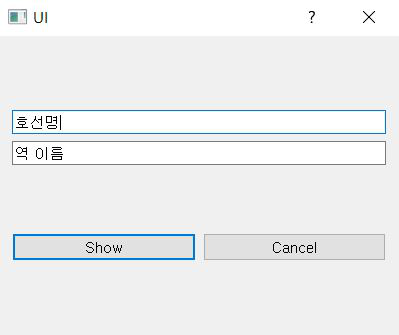

# Number of Passengers
## 서울 지하철 출퇴근시간대 **승차 인원** 통계 
- (03.08-03.10: 데이터시각화), (03.10, 03.13: UI 생성)

## 목표 
> 지하철 출퇴근시간대 중, 가장 밀집도 높은 시간대 판별

### 원본에서 추출한 데이터 (column)
- 시간대별 승차인원

### 사용자 입력
- 호선번호
- 역 이름

### 출력
- 전체 시간대별 인원 수 막대 그래프로 출력
- 전체 시간대별 인원 수 알림창으로 출력

### 결과물 예시
- 시안

- 최종 (UI 및 시각화/수치화 된 데이터. (3호선 고속터미널 예시))
 

### 간단한 결과분석
> 승차인원만 기준으로 한 통계다
- 강남역, 을지로3가역 등의 번화가, 도심은 주로 저녁시간대 인원이 몰려있고,
- 주거지역은 오전시간대 인원이 몰린 걸 알 수 있었다.